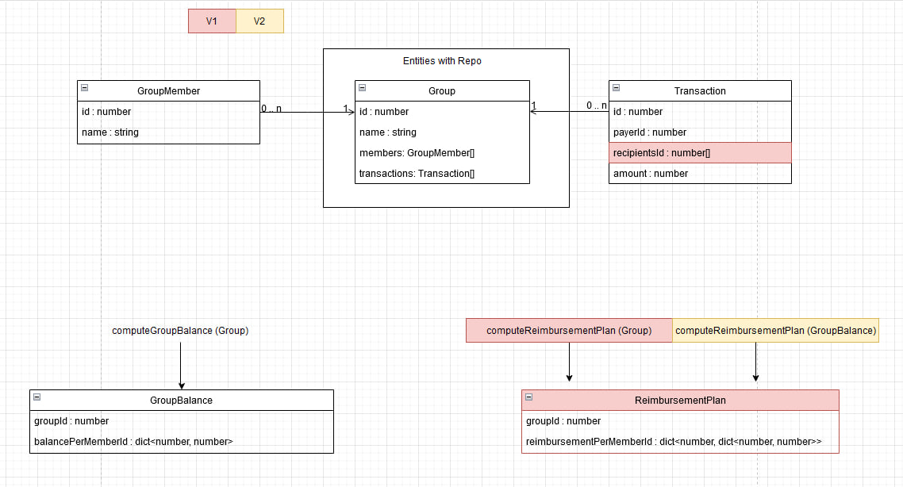

# Tricount using Clean Architecture

Welcome to our Tricount project, built using TDD and Clean architecture.

The goal of the project is to practice and improve our TDD and Clean architecture understandings.

## Core functionment

Here are the description of our entities and their relationships.



For now, we fully developped the V1 of our app, meaning you can create a group, manage members and transactions, compute the balance of each member and compute a simple reimbursement plan.

The next steps would be to :

- Develop a way to compute more optimized ReimbursementPlans (minimizing the number of actions needed to balance the group)
- Add a field in Transaction to apply it to a whole group
- Add descriptions/photos to Transactions
- Create a user entity that can be linked to multiple group members
...

## Backend

Technologies:

- Typescript
- Node v18
- [Vitest](https://vitest.dev/)
- Fastify server

### Get started

To share the same configuration, you can open the following workspace with VSCode `.vscode/tricount.code-workspace`, it should open the project!

**Note:** You should see two root folders in the explorer `tricount` (project root folder) and `backend` (backend root folder). This way, we can share the same configuration for multiple services, but still enjoy VSCode power in each sub-project (for example auto-format, debugging, etc.).

1. Make sure you are using node v18
2. Go into the `backend` directory
3. Install the dependancies with `npm i`
4. You can run the project with `npm start` and the API will be accessible at [localhost:8080](http://localhost:8080).
5. Or you can run the test with `npm test`, it will run the tests in watch mode.

**Note:** The dev server occasionnaly crash when editing files, you just to restart it manually.

### Swagger / OpenAPI

During development, you can access a swagger at [localhost:8080/docs](http://localhost:8080/docs).

### How to create a controller

Controller template:

```typescript
export const ExampleController: FastifyPluginAsync<{
  repositories: { group: GroupRepository };
}> = async (fastify: FastifyInstance, options): Promise<void> => {
  // Retrieve necessary dependencies
  const { group } = options.repositories;

  // Register routes with usecase, etc.
  // Use typebox to generate the swagger and parse the incoming request
  // ...
};
```

Then, register it in `fastify.ts` with

```typescript
await server.register(ExampleController, { prefix: "/example", repositories });
```
